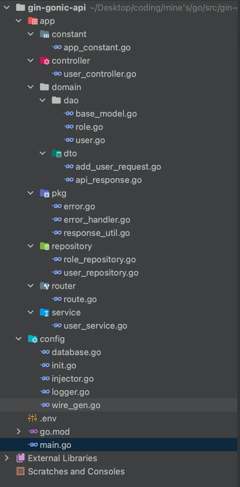

## STRUCTURE

# 1. VERSION VIETNAM

## Cấu trúc Dự án

### app

Chứa các thành phần chính của ứng dụng.

#### constant

Lưu trữ các hằng số sử dụng trong toàn ứng dụng.

- **app_constant.go**: Chứa các hằng số cụ thể của ứng dụng.

#### controller

Quản lý các yêu cầu và phản hồi từ người dùng.

- **user_controller.go**: Xử lý các endpoint liên quan đến người dùng.

#### domain

Đại diện cho các đối tượng và mô hình liên quan đến nghiệp vụ.

##### dao (Data Access Object)

Các đối tượng tương tác trực tiếp với cơ sở dữ liệu.

- **base_model.go**: Định nghĩa cấu trúc mô hình cơ bản cho các thực thể cơ sở dữ liệu.
- **role.go**: Định nghĩa thực thể vai trò và các tương tác với cơ sở dữ liệu.
- **user.go**: Định nghĩa thực thể người dùng và các tương tác với cơ sở dữ liệu.

##### dto (Data Transfer Object)

Các đối tượng chuyển dữ liệu giữa các tiến trình.

- **add_user_request.go**: DTO cho các yêu cầu tạo người dùng.
- **api_response.go**: DTO cho các phản hồi API.

#### pkg

Chứa các gói và tiện ích dùng chung.

- **error.go**: Định nghĩa cấu trúc xử lý lỗi.
- **error_handler.go**: Xử lý các lỗi trong ứng dụng.
- **response_util.go**: Các hàm tiện ích để xử lý phản hồi.

#### repository

Chứa các lớp tương tác với cơ sở dữ liệu.

- **role_repository.go**: Repository cho các thao tác cơ sở dữ liệu liên quan đến vai trò.
- **user_repository.go**: Repository cho các thao tác cơ sở dữ liệu liên quan đến người dùng.

#### router

Quản lý định tuyến các yêu cầu HTTP.

- **route.go**: Định nghĩa các tuyến đường của ứng dụng.

#### service

Chứa logic nghiệp vụ và lớp dịch vụ.

- **user_service.go**: Lớp dịch vụ cho các thao tác liên quan đến người dùng.

### config

Quản lý cấu hình ứng dụng.

- **database.go**: Cấu hình cơ sở dữ liệu và thiết lập kết nối.
- **init.go**: Cài đặt khởi tạo cho ứng dụng.
- **injector.go**: Thiết lập dependency injection.
- **logger.go**: Cấu hình logger.
- **wire_gen.go**: Sinh mã cho wire dependency injection.

### .env

File cấu hình các biến môi trường.

### go.mod

File cấu hình module Go, quản lý các phụ thuộc.

### main.go

Điểm khởi đầu của ứng dụng.

# 2. VERSION ENGLISH

## Project Structure

### app

Contains the main components of the application.

#### constant

Holds constants used throughout the application.

- **app_constant.go**: Contains application-specific constants.

#### controller

Manages user requests and responses.

- **user_controller.go**: Handles user-related API endpoints.

#### domain

Represents the business objects and models.

##### dao (Data Access Object)

Objects that directly interact with the database.

- **base_model.go**: Defines the base model structure for database entities.
- **role.go**: Defines the role entity and its database interactions.
- **user.go**: Defines the user entity and its database interactions.

##### dto (Data Transfer Object)

Objects that carry data between processes.

- **add_user_request.go**: DTO for user creation requests.
- **api_response.go**: DTO for API responses.

#### pkg

Contains reusable packages and utilities.

- **error.go**: Defines error handling structures.
- **error_handler.go**: Handles application errors.
- **response_util.go**: Utility functions for handling responses.

#### repository

Contains database interaction layers.

- **role_repository.go**: Repository for role-related database operations.
- **user_repository.go**: Repository for user-related database operations.

#### router

Manages routing of HTTP requests.

- **route.go**: Defines application routes.

#### service

Contains business logic and service layer.

- **user_service.go**: Service layer for user-related operations.

### config

Manages application configuration.

- **database.go**: Database configuration and connection setup.
- **init.go**: Initialization settings for the application.
- **injector.go**: Dependency injection setup.
- **logger.go**: Logger configuration.
- **wire_gen.go**: Wire dependency injection code generation.

### .env

Environment variables configuration file.

### go.mod

Go module configuration file, manages dependencies.

### main.go

Entry point of the application.
