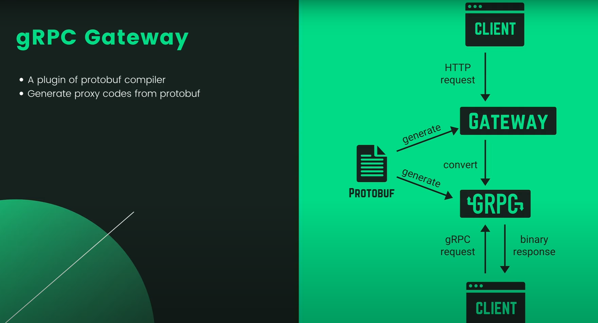

# 1. Install Go

```cmd
    curl -OL https://golang.org/dl/go1.22.3.linux-386.tar.gz
    sha256sum go1.16.7.linux-amd64.tar.gz
    sudo tar -C /usr/local -xvf go1.22.3.linux-386.tar.gz
    sudo nano ~/.profile
    export PATH=$PATH:/usr/local/go/bin
    source ~/.profile
    go version
    sudo apt-get install gcc-multilib
    CFLAGS="-m32 -ansi -D_SVID_SOURCE -DOSS_AUDIO -D'ARCH=\"$host_cpu\"' $CFLAGS"
    CFLAGS="-ansi -D_SVID_SOURCE -DOSS_AUDIO -D'ARCH=\"$host_cpu\"' $CFLAGS"
```

# 2. Install SQLC

```cmd
    sudo snap install sqlc
```

# 3. GO mod

## Init Repositories

```cmd
    go mod init github.com/fdhhhdjd/Banking_Platform_Golang
```

## Install lib

```cmd
    go get <Github>
    go get github.com/google/uuid
```

## Uninstall lib

```cmd
    go get package@none
```

## Edit LIB

```cmd
    go mod tidy
```

## Delete cache

```cmd
    go clean -testcache
```

## 4. gRPC

# 

# [Doc gRPC](https://grpc.io/docs/languages/go/quickstart/)

```cmd
    sudo apt install -y protobuf-compiler
    protoc --version
```

```cmd
    go install google.golang.org/protobuf/cmd/protoc-gen-go@v1.28
    echo 'export PATH="$PATH:$(go env GOPATH)/bin"' >> ~/.bashrc
    source ~/.bashrc
    protoc-gen-go --version
```

```cmd
    go install google.golang.org/grpc/cmd/protoc-gen-go-grpc@v1.2
    protoc-gen-go-grpc --version
```

```cmd
    show service

    package pb

    service SimpleBank
```

# settings > enter "proto3" > edit settings

```cmd
    "protoc": {
        "options": ["--proto_path=protos"]
    }
```

# 

# [Doc evans](https://github.com/ktr0731/evans)

# Download evans and grpcurl

```cmd
    go install github.com/ktr0731/evans@latest
```

```cmd
    evans --host localhost --port 5005 -r repl
```

```cmd
    wget https://github.com/fullstorydev/grpcurl/releases/download/v1.7.0/grpcurl_1.7.0_linux_x86_64.tar.gz

    tar -xvf grpcurl_1.7.0_linux_x86_64.tar.gz

    chmod +x grpcurl

    ./grpcurl -help

    sudo mv grpcurl /usr/local/bin/
```

```cmd
    grpcurl -plaintext localhost:5005 list

    grpcurl -plaintext localhost:5005 describe pb.SimpleBank

    grpcurl -plaintext -d '{"username": "testuser", "full_name": "Test User", "email": "test@example.com", "password": "password"}' localhost:5005 pb.SimpleBank/CreateUser

    grpcurl -plaintext -d '{"username": "testuser", "password": "password"}' localhost:5005 pb.SimpleBank/LoginUser

```

## 5. gRPC Gateway

# 

# [gRPC Gateway](https://github.com/grpc-ecosystem/grpc-gateway)

# Create folder tools> tools.go >

```go
package tools

import (
    _ "github.com/grpc-ecosystem/grpc-gateway/v2/protoc-gen-grpc-gateway"
    _ "github.com/grpc-ecosystem/grpc-gateway/v2/protoc-gen-openapiv2"
    _ "google.golang.org/grpc/cmd/protoc-gen-go-grpc"
    _ "google.golang.org/protobuf/cmd/protoc-gen-go"
)
```

# > go mod tidy >

```cmd
$ go install \
    github.com/grpc-ecosystem/grpc-gateway/v2/protoc-gen-grpc-gateway \
    github.com/grpc-ecosystem/grpc-gateway/v2/protoc-gen-openapiv2 \
    google.golang.org/protobuf/cmd/protoc-gen-go \
    google.golang.org/grpc/cmd/protoc-gen-go-grpc
```

# > Clone google api > https://github.com/googleapis/googleapis >

# copy file need into source code banking of me

```cmd
    google/api/annotations.proto
    google/api/field_behavior.proto
    google/api/http.proto
    google/api/httpbody.proto
```

```cmd
    cp google/api/annotations.proto ~/Documents/Code/Banking-Platform-Golang/proto/google/api/
    ...
```

## 6. Worker

# 
