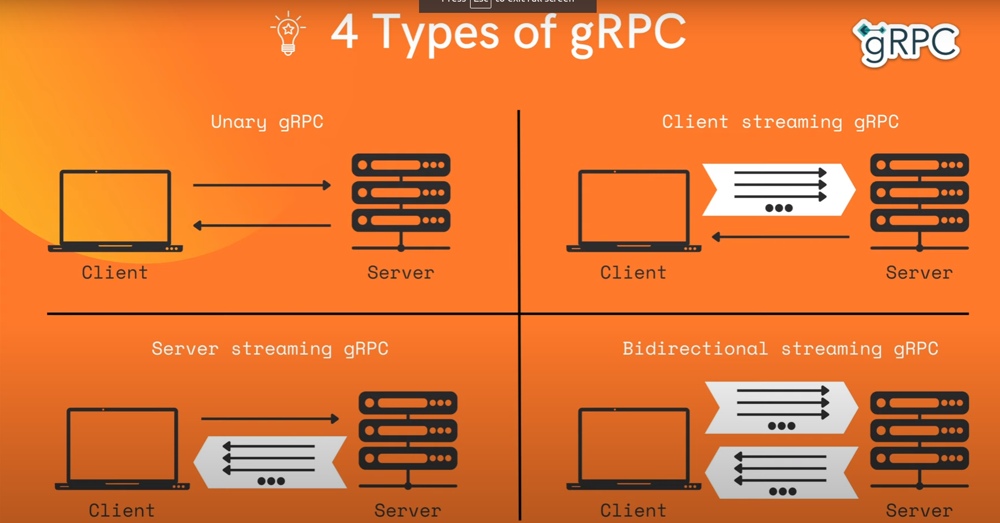
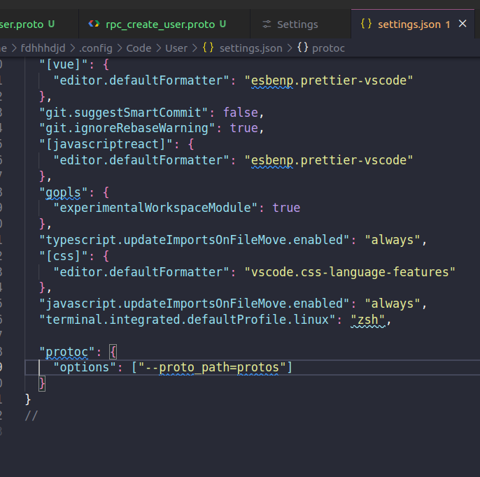

# 1. Install Go

```cmd
    curl -OL https://golang.org/dl/go1.22.3.linux-386.tar.gz
    sha256sum go1.16.7.linux-amd64.tar.gz
    sudo tar -C /usr/local -xvf go1.22.3.linux-386.tar.gz
    sudo nano ~/.profile
    export PATH=$PATH:/usr/local/go/bin
    source ~/.profile
    go version
    sudo apt-get install gcc-multilib
    CFLAGS="-m32 -ansi -D_SVID_SOURCE -DOSS_AUDIO -D'ARCH=\"$host_cpu\"' $CFLAGS"
    CFLAGS="-ansi -D_SVID_SOURCE -DOSS_AUDIO -D'ARCH=\"$host_cpu\"' $CFLAGS"
```

# 2. Install SQLC

```cmd
    sudo snap install sqlc
```

# 3. GO mod

## Init Repositories

```cmd
    go mod init github.com/fdhhhdjd/Banking_Platform_Golang
```

## Install lib

```cmds
    go get <Github>
    go get github.com/google/uuid
```

## Edit LIB

```cmd
    go mod tidy
```

## Delete cache

```cmd
    go clean -testcache
```

## 4. gRPC

# 

# [Doc gRPC](https://grpc.io/docs/languages/go/quickstart/)

```cmd
    sudo apt install -y protobuf-compiler
    protoc --version
```

```cmd
    go install google.golang.org/protobuf/cmd/protoc-gen-go@v1.28
    echo 'export PATH="$PATH:$(go env GOPATH)/bin"' >> ~/.bashrc
    source ~/.bashrc
    protoc-gen-go --version
```

```cmd
    go install google.golang.org/grpc/cmd/protoc-gen-go-grpc@v1.2
    protoc-gen-go-grpc --version
```

# settings > enter "proto3" > edit settings

```cmd
    "protoc": {
        "options": ["--proto_path=protos"]
    }
```

# 
